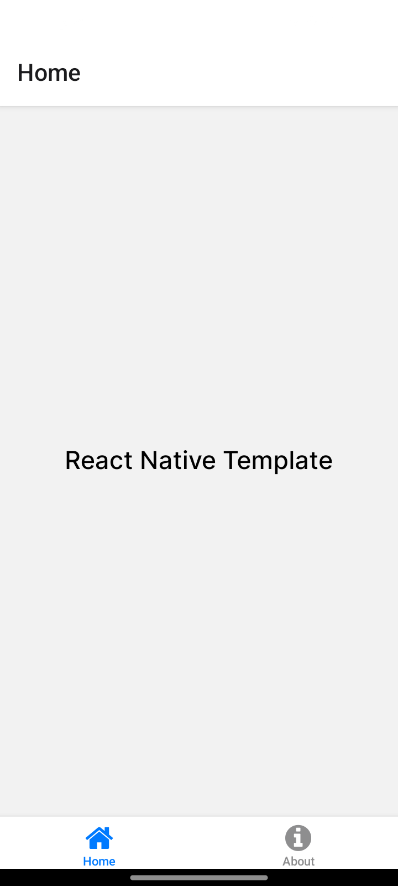
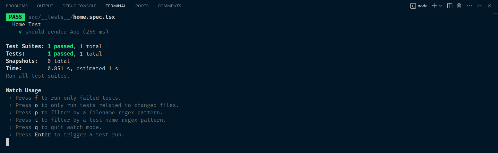

<h2 align='center'>:earth_americas: React Native Template (Expo) :earth_americas:</h2>

<p align="center">
  <br>
<<<<<<< HEAD
  
=======
  
>>>>>>> Aleydon
  <br>
  <br>
</p>

## :pushpin: Requirements: :pushpin:

NodeJs: :link: https://nodejs.org/en/
<br />
Expo: :link: https://docs.expo.dev/

---

<h2>Template configuration:</h2>

- Jest + React Native Testing Library for automated testing. :link: https://jestjs.io/ + https://callstack.github.io/react-native-testing-library/.
- Eslint + Prettier for code standardization and formatting. :link: https://eslint.org/ + https://prettier.io/.
- Typescript for typing. :link: https://www.typescriptlang.org/
- Nativewind for styling components. :link: https://www.nativewind.dev/getting-started/expo-router.
- HuskyJs for automatically lint your commit messages, code, and run tests upon committing or pushing. :link: https://typicode.github.io/husky/

---

<h2>Relative Paths Config:</h2>

```sh
  "baseUrl": "."
    "paths": {
      "@components/*": ["src/components/*"],
      "@constants/*": ["src/constants/*"],
      "@utils/*": ["src/utils/*"],
      "@hooks/*": ["src/hooks/*"],
      "@assets/*": ["src/assets/*"],
      "@services/*": ["src/services/*"],
      "@context/*": ["src/context/*"]
    }
```

#### :arrow_forward: Get Started:

1. Clone this repo

```sh
git clone https://github.com/Aleydon/React-Native-Template.git
```

2. Install NPM packages

```sh
npm install or yarn
```

3.  Run this project

```sh
npm run start or yarn start
```

In the output, you'll find options to open the app in a

- [development build](https://docs.expo.dev/develop/development-builds/introduction/)
- [Android emulator](https://docs.expo.dev/workflow/android-studio-emulator/)
- [iOS simulator](https://docs.expo.dev/workflow/ios-simulator/)
- [Expo Go](https://expo.dev/go), a limited sandbox for trying out app development with Expo

You can start developing by editing the files inside the **app** directory. This project uses [file-based routing](https://docs.expo.dev/router/introduction).

<h2>Tests:</h2>

- How to run tests:

```sh
npm run test or npm run test:watch
```

It has an example of tests with Jest + React-Native-Testing-Library in _app/**tests**/home.spec.tsx_

```ts
import { render } from '@testing-library/react-native';

import Home from 'src/app/(tabs)';

describe('Home Test', () => {
<<<<<<< HEAD
  it('should render App', () => {
=======
  it('should render Home', () => {
    const homeComponent = render(<Home />);
    expect(homeComponent).toBeDefined();
  });
  it('should get text on screen', () => {
>>>>>>> Aleydon
    const { getByText } = render(<Home />);
    const text = getByText('React Native Template');
    expect(text).toBeDefined();
  });
});

```

<h2>Test Running:</h2>
<p align="center">
  <br>
  
  <br>
  <br>
</p>
